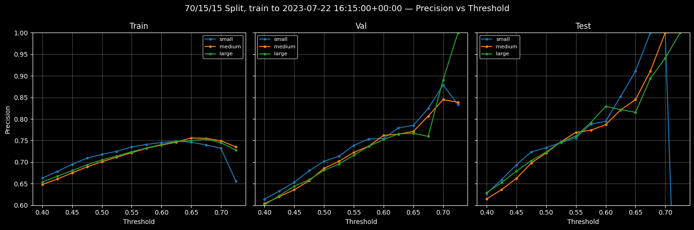
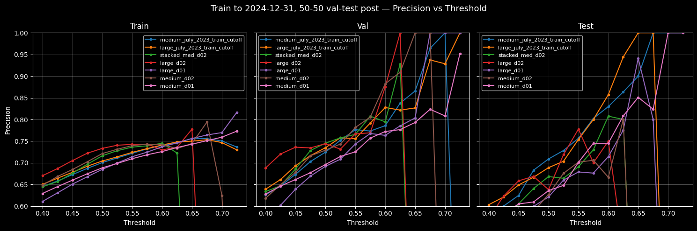
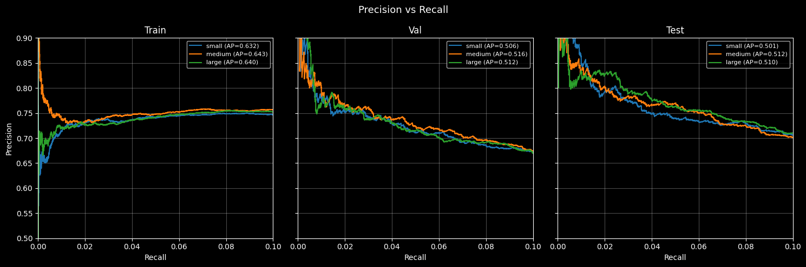
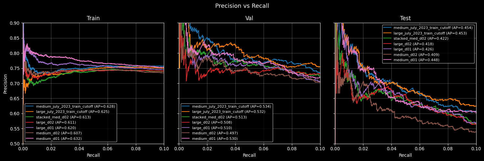

# LSTM Market Classifier

A dual-tower LSTM binary classifier for short-term price movement in financial time-series data, built from scratch: scraper, data cleaning, feature engineering, and model.

## Overview

I built this to predict whether the trading pair will hit a 0.5% price target within the next 2 hours (8 x 15-minute intervals), controlled for a maximum possible loss across the window (stop-loss). The model performs inference on 24-hour sliding windows from two exchanges:

- **Spot exchange** — OHLCV candlestick data with 22 engineered technical features
- **Derivatives exchange** — Open interest and long/short ratio data with 12 features

The addition of the derivatives exchange provides complementary information about market sentiment and fragility.

One of the more interesting engineering decisions was splitting these two sources into separate LSTM input branches rather than merging them. Derivatives data only exists from mid-2020, while the spot data goes back to 2017. A single merged input would have wasted years of spot training data to a cold-start period while the model slowly learned that a previously zeroed signal had become meaningful. The dual-tower approach lets each branch learn on its own timeline, with a Masking layer handling the derivatives gap.

With threshold optimisation, the best configuration achieves **0.75 precision against a 0.23 baseline** on the test set.

## Iteration History

This is the third iteration. Each version was based on research and measured results.

- **V1** (Dense layers - MLP) A lesson in labelling and future leakage. This seemed to perform surprisingly well for a simple multi-layer perceptron until I discovered future leakage in the labels. Also, degradation between validation and test led me to consider an architecture more adapted to time-series.
- **V2** (Single-source LSTM) taught me about gap finding, interpolation, and the importance of normalisation. Now with accurate labels, its complete failure on test data led me to investigate non-stationarity.
- **V3** (Dual-tower LSTM) is the current version, focused on addressing the deepest problem: shifting distributions across time. My label distribution moves from roughly 60/40 to 25/75 between training and test. This is particularly hard to address because the sequence itself is the signal, limiting opportunities to normalise between sets.

## Architecture

```
Spot Input (96, 22)             Derivatives Input (96, 12)
        |                               |
   LSTM (128)                    Masking(0.0)
        |                               |
        |                          LSTM (64)
        |                               |
        +---------- Concatenate --------+
                        |
                   Dense(64, ReLU)
                        |
                    Dropout(0.1)
                        |
                   Dense(32, ReLU)
                        |
                    Dropout(0.1 | 0.2)
                        |
                Dense(1, Sigmoid) → Buy / Hold
```

Four configurations tested:
- small (64/32), 
- medium (128/64), 
- large (256/128), and 
- stacked medium (128/64 x2 LSTM layers).
  
All converge to similar validation/test AUC, which suggests the key structural limit is the feature set rather than model capacity.

## Project Structure

```
├── market_scraper/                         # Exchange API scraper framework
│   ├── core/                               # Abstract base class, shared utilities
│   │   ├── base_scraper.py                 # Retry logic, rate limiting, pagination
│   │   ├── constants.py                    # Shared intervals, data types
│   │   ├── utilities.py                    # Time conversion, file I/O, deduplication
│   │   ├── exchange_config.py              # Frozen dataclass for API config
│   │   └── tagged_keys.py                  # Generic feature key registry
│   └── exchanges/
│       ├── exchange_a/                     # Spot kline scraper + response parsing
│       └── exchange_b/                     # Derivatives OI + long/short ratio scrapers
├── market_data/                            # Scraped datasets (not included — see Setup)
├── trading_models/                         # Trained .keras model files (not included)
├── labelling.py                            # Label generation (private)
├── dataset_cleaning.py                     # Data cleaning pipeline (private)
├── engineered_features.py                  # Feature engineering (private)
├── BinaryProfit_v3_mixed_timeframes.ipynb  # Model evaluation and visualisation
├── images/                                 # Result diagrams exported from notebook
└── requirements.txt
```

Data cleaning, feature engineering, and labelling modules are not included in this public repository. Full source on request.

## Data Pipeline

### Collection (`market_scraper/`)

I started by writing a scraper to pull data via API and stitch requests into clean datasets. It grew into a full sub-project with an abstract base class and exchange-specific classes handling rate limiting, retry with error logging, pagination, and deduplication. Spot data spans August 2017 to present; derivatives from July 2020.

### Cleaning

Exchange APIs return gaps, zero-filled outage rows, and duplicates. These all compound into label corruption downstream if not handled. The cleaning pipeline uses flags to track every transformation:

```python
class CleaningCols(StrEnum):
    MISSING_AT_SCRAPE = auto()    # whole row absent from API response
    SEGMENT_ID = auto()           # contiguous data block ID (-1 for gaps)
    IS_INTERPOLATED = auto()      # single-row gap filled via carry-forward
    NONFILLED_GAP = auto()        # multi-candle gap (not interpolated)
    OHLC_ZERO_AT_SCRAPE = auto()  # one or more OHLC values were zero/NaN
    VOL_ZERO_AT_SCRAPE = auto()   # volume features were zero/NaN
    ...
```

The pipeline:

- Re-indexes to set intervals and flags scraper gaps
- Finds the valid start point (first window of consecutive non-gap rows)
- Interpolates single-candle gaps (carry-forward), though not those that cross gaps > 1 interval. Compounding errors on windowed features is unreliable in a volatile market.
- All gaps, interpolated or not, are flagged for downstream feature engineering and labelling.
- Identifies contiguous segments so rolling indicators are never computed across data gaps, where they'd otherwise poison every downstream feature by smoothing a temporal jump.

Every cleaning decision has a butterfly effect and so required extended work identifying ideal parameters to balance domain properties, risk and model performance.

### Feature Engineering

34 features across five categories:

- **Volatility and range**
- **Price action** — multiple timeframes
- **Volume and trade activity**
- **Derivatives sentiment**
- **Temporal** — trigonometric cyclical encoding

Features have been engineered to maximise windowed historical information, temporal normalisation, and indicate multi-level regime change and momentum.

Non-stationarity has been principally addressed through feature normalisation. Normalisation is feature dependent, and includes various logarithmic transformations, median centring and tanh scaling. Normalisation is segment-aware so that it never crosses data gaps.

### Labelling

Binary labels: **1** (buy) if the price target is hit within the lookahead window, subject to a risk management heuristic. A research-backed heuristic volatility filter is also applied to rule out flat periods where the target shouldn't be organically attainable (market manipulation filter).

Labels are invalidated if any row in the lookahead window was missing genuine data at scrape time. Without this check, gaps silently corrupt the labels.

## Model Training

- **Temporal split** — 70% train / 15% validation / 15% test, strictly ordered (no shuffle, no future leakage)
- **96-timestep sliding windows** — 24 hours of 15-minute candles per sample
- **279,711 valid sequences** — 190,957 train / 44,265 val / 44,265 test
- **Optimiser** — Adam with binary crossentropy loss
- **Callbacks** — EarlyStopping (patience=10), ModelCheckpoint (best val_loss)

The training set is roughly balanced (~42% positive), but this shifts to ~27% in validation and test as market conditions change. No class balancing was applied; given the market's non-stationarity, corrections calibrated to one period's distribution would need ongoing recalibration or risk masking genuine regime shifts.

## Results

Two evaluation configurations test how well the model generalises across time:

- **Task 1 (70/15/15 split)** — training ends July 2023; standard temporal split
- **Task 2 (train to 2024-12-31)** — all data through end of 2024; validation and test are a 50-50 chronological split from the start of 2025 to February 2026.

Precision is the main metric for which I've optimised. A false positive means a bad trade, whereas a false negative is only a missed opportunity. Minimising false positives is more important than recall in this domain.

### Precision vs Threshold




### Precision-Recall Curves




### Sample: medium (128/64) on Task 1 test set (Oct 2024 - Feb 2026)

```
medium | Test (44,463 samples, 27.17% positive)

Threshold   Precision   Recall      F1
0.450       0.6622      0.1416      0.2334
0.500       0.7213      0.0820      0.1473
0.550       0.7689      0.0488      0.0917
0.600       0.7867      0.0235      0.0457
```

### Sample: large (256/128) July 2023 train cutoff on Task 2 validation and test (50-50 split, 2025 - Feb 2026):

```
large_july_2023_train_cutoff | Validation (19,103 samples, 28.65% positive)

Threshold   Precision   Recall      F1              
0.450       0.6932      0.1734      0.2774      
0.500       0.7349      0.1175      0.2026      
0.550       0.7555      0.0751      0.1366      
0.575       0.7918      0.0563      0.1051      
0.600       0.8276      0.0395      0.0753      
0.625       0.8217      0.0236      0.0458      
0.650       0.8267      0.0113      0.0224      
0.675       0.9375      0.0055      0.0109

large_july_2023_train_cutoff | Test (19,104 samples, 22.51% positive)
Threshold   Precision   Recall      F1
0.450       0.6489      0.0821      0.1457       
0.500       0.6888      0.0458      0.0859       
0.550       0.7538      0.0228      0.0442      
0.575       0.8000      0.0167      0.0328      
0.600       0.8571      0.0084      0.0166      
0.625       0.9444      0.0040      0.0079      
0.650       1.0000      0.0012      0.0023
0.675       1.0000      0.0005      0.0009      
```

With threshold tuning, all architectures exceed 0.75 precision on unseen data. The model has learned meaningful signal. The precision-recall trade-off is steep, which is expected given the distribution shift. Higher confidence predictions are substantially more reliable.

All converge to similar precision threshold degradation curves (AUC), which suggests the key structural limit is the feature set rather than model capacity.

An unexpected finding from Task 2: the medium and large models trained to the earlier cutoff (July 2023) outperformed models trained on 18 months of additional data. More training data isn't always better in a non-stationary domain. The additional period likely introduced regime-specific patterns that diluted the signal rather than reinforced it. Future versions should deal with this tension: sliding window of relevance vs global truths.

This domain shift is confirmed by the reduced performance of all models on Task 2 Mid-2025 - Feb 2026 test set.

On Task 2, the optimal model and threshold gives 75.4% precision vs 2.3% recall, or 80% precision vs 1.7% recall (both Large-July Cutoff).

Recall is low, but both configurations give a stable baseline off which a cautious but profitable deployment strategy could be developed. At 80% precision, the model still presents 255 true positive trading signals across 7 months.

The impact of regime non-stationarity is underscored by the chronological degradation of model performance. Recall performance on the Task 2 test set is roughly half that achieved on the validation set. Looking at the results:
- The test set is an unusually punishing and unpredictable regime for a model trained to generalise market behaviours.
- The models have all learned real signal. Some even achieved 100% precision on Validation and Test, though at unusably low recall.
- Further work is needed to adapt to the domain's non-stationarity. 


Implications for a future iteration:
- LSTM architectures have converged to similar results. Unlikely to get further improvements with this architecture.
- The outperformance of the models with the earlier train cut-off suggests an unreliable recency bias and therefore weakness of a pure LSTM approach.
- The model architecture should combine learned foundational rules with recent dynamics to address non-stationarity. Feature engineering appears to have hit a limit here.
- Future models might consider a hybrid architecture. Possible candidates include a transformer tower for global attention alongside a recency-focused temporally linear tower. The latter might be an LSTM, or possibly a 1D-CNN. A third possibility, taken from the domain of sports analytics, would be a 2D-CNN for implicit trajectory analysis of medium-term windows as a third, auxiliary tower; it would be interesting to see whether this added real value over traditional linear analysis tools for representing market momentum (as already implemented in my feature engineering).
- Any major further gains are likely to come from incorporating new orthogonal features. A likely first candidate is sentiment analysis. 

## Setup

```bash
git clone https://github.com/ahalp90/lstm-market-classifier.git
cd lstm-market-classifier
python -m venv .venv
source .venv/bin/activate
pip install -r requirements.txt
```

The scraper framework is fully functional. Data files (~160 MB) are not included but can be regenerated from the exchange APIs.

The notebook provided has had about a dozen cells removed and relies extensively on private modules for feature engineering and data preparation.

## Technologies

- Python 3.12 / TensorFlow 2.20 / Pandas 2.3 / NumPy 2.3
- pandas-ta-classic for technical indicators
- scikit-learn for evaluation metrics
- matplotlib for visualisation
- Exchange REST APIs